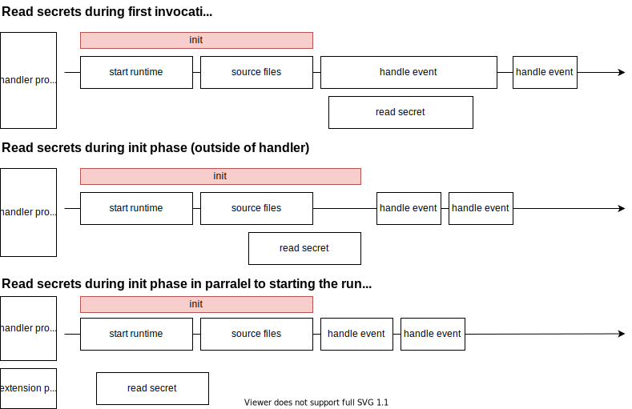

# AWS Lambda Extension secret cache

This AWS lambda extension fetches secrets from the AWS Secrets Manager during init phase of the lambda cold start and then exposes them on a local web server, so that the lambda can access the secret value by making a http call to the local web server.

**Note** This is a proof-of-concept implementation. Use this in production on your own risks.

## What problem does this extension solves

It is best practice to put secrets for a lambda execution into secretsmanager. This means you have to load the secret values the first time the lambda starts (cold-start).
Reading a secret value is done by calling the AWS Secrets Manager api. This api call takes about 100ms per secret.
In cases where the actual computation is very simple most of the cold start time is therefore used for retrieving the secret values.

The following graphic shows the difference between ways of loading a secret value into the lambda runtime.



## Compile package and dependencies

You can compile the lambda extension to both currently supported AWS lambda runtimes. The default build runtime is `amd64`.

To compile for the ARM runtime set an env variable `export ARCH=arm64`.

Building and saving package into a `bin/extensions` directory:

```bash
./scripts/build.sh
```

This creates a go binary for the target architecture.

## Layer Setup Process

The extensions .zip file should contain a root directory called `extensions/`, where the extension executables are located. In this project we must include the `secret-cache-extension` binary.

Creating zip package for the extension:

```bash
./scripts/bundle.sh
```

Ensure that you have aws-cli v2 for the commands below.
Publish a new layer using the `extension.zip`. The output of the following command should provide you a layer arn.

```bash
aws lambda publish-layer-version \
 --layer-name "secret-cache-extension" \
 --region <use your region> \
 --zip-file  "fileb://extension.zip"
```

Note the LayerVersionArn that is produced in the output.
eg. `"LayerVersionArn": "arn:aws:lambda:<region>:123456789012:layer:<layerName>:1"`

Add the newly created layer version to a Lambda function.

## Usage

**Prerequisites**
The lambda must have permissions to read the secrets

All environment variables that start with `SECRET_` will be loaded and cached during init phase.
The value of environment variable can be either the `secret name` or the `secret arn`.

In the lambda handler itself the secret value can be accessed be making an http get call to

`http://localhost:4000?name=<MY_SECRET_NAME>`

<MY_SECRET_NAME> hereby is the value of the environment variable for that secret.

### Example in AWS CDK

```javascript
export class SecretLambdaWithExtension extends Construct {
  constructor(scope: Construct, id: string) {
    super(scope, id);

    const secret = new Secret(this, "Secret");

    const layer = new LayerVersion(this, "SecretsCacheLayer", {
      // reference the bundled extension zip file
      code: new AssetCode(resolve(__dirname, "extension.zip")),
      compatibleArchitectures: [Architecture.X86_64],
    });

    const lambda = new NodejsFunction(this, "Lambda", {
      entry: "lib/secret-test/handler.ts",
      environment: {
        SECRET_MYSECRET: secret.secretName,
      },
      layers: [layer],
    });

    secret.grantRead(lambda);
  }
}
```

and a basic handler then looks like

```javascript
import fetch from "node-fetch";
export const handler = async () => {
  const secretName = process.env.SECRET_MYSECRET;

  const secret = await fetch(
    `http://localhost:4000/secrets?name=${secretName}`
  ).then((res) => res.text());

  console.log(secret);
};
```

## Function Invocation and Extension Execution

When invoking the function, you should now see log messages from the example extension similar to the following:

```
    XXXX-XX-XXTXX:XX:XX.XXX-XX:XX    EXTENSION Name: go-example-extension State: Ready Events: [INVOKE,SHUTDOWN]
    XXXX-XX-XXTXX:XX:XX.XXX-XX:XX    START RequestId: 9ca08945-de9b-46ec-adc6-3fe9ef0d2e8d Version: $LATEST
    XXXX-XX-XXTXX:XX:XX.XXX-XX:XX    [go-example-extension]  Registering...
    XXXX-XX-XXTXX:XX:XX.XXX-XX:XX    [go-example-extension]  Register response: {
                "functionName": "my-function",
                "functionVersion": "$LATEST",
                "handler": "function.handler"
        }
    XXXX-XX-XXTXX:XX:XX.XXX-XX:XX    [go-example-extension]  Waiting for event...
    XXXX-XX-XXTXX:XX:XX.XXX-XX:XX    [go-example-extension]  Received event: {
                "eventType": "INVOKE",
                "deadlineMs": 1234567890123,
                "requestId": "9ca08945-de9b-46ec-adc6-3fe9ef0d2e8d",
                "invokedFunctionArn": "arn:aws:lambda:<region>:123456789012:function:my-function",
                "tracing": {
                        "type": "X-Amzn-Trace-Id",
                        "value": "XXXXXXXXXX"
                }
        }
    XXXX-XX-XXTXX:XX:XX.XXX-XX:XX    [go-example-extension]  Waiting for event...
    ...
    ...
    Function logs...
    ...
    ...
    XXXX-XX-XXTXX:XX:XX.XXX-XX:XX    END RequestId: 9ca08945-de9b-46ec-adc6-3fe9ef0d2e8d
    XXXX-XX-XXTXX:XX:XX.XXX-XX:XX    REPORT RequestId: 9ca08945-de9b-46ec-adc6-3fe9ef0d2e8d Duration: 3.78 ms	Billed Duration: 100 ms	Memory Size: 128 MB	Max Memory Used: 59 MB	Init Duration: 264.75 ms
```
